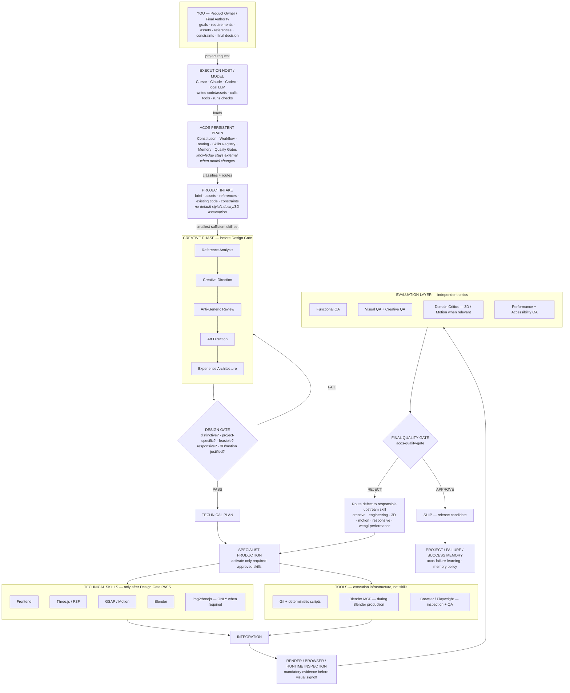

# ACOS — Actual Product Runtime Workflow

**Version:** 1.2 (canonical-aligned)  
**Authority:** `ACOS_FINAL_CANONICAL_v1.2.md`  
**Type:** Runtime workflow diagram — visual summary only; canonical docs win on conflict.

Execution engines (Cursor, Claude, Codex, local models) are replaceable. ACOS is the persistent operating intelligence.

---

## Runtime workflow

---

## Canonical alignment notes

1. **Creative phase only before Design Gate** — no full specialist production before gate pass (Constitution #6).
2. **Anti-Generic Review** is explicit — not merged into art direction.
3. **Technical skills activate after Design Gate PASS** — availability ≠ activation.
4. **Tools are separate** — Browser/Playwright primarily for inspection/QA; Blender MCP for Blender execution.
5. **Render/browser inspection** is mandatory before visual QA signoff (Constitution #14).
6. **Rejections route to responsible skill** — functional failures do not always return to creative layer.
7. **End state includes memory writeback** — not only “release candidate.”

## What this diagram is not

- Not a foundation implementation checklist (Phase A–J).
- Not a skill import map (Phase B).
- Not a benchmark or sample project workflow.

For machine-readable skill inventory see `registry/SKILLS.yaml`.
